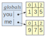
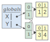

# 数据别名

编程最棘手的事情之一是确切地确定变量所指的数据。 请记住，我们使用`data`和`salary`这样的名称来表示保存数据值的内存单元。 名称比物理内存地址更容易记住，但我们可能被愚弄。 例如，显然两个变量`x`和`y`都可以具有相同的整数值 7：

```python
x = y = 7
print(x,y)

# 7 7
```

但是，你知道他们都指的是同一个 7 对象吗？ 换句话说，Python 中的变量始终是引用或指向数据的指针，因此变量在技术上并不是持有值。 指针就像电话号码“指向”手机，但指针本身不是手机本身。

我们可以使用内置的`id(x)`函数来发现这个间接的秘密层次，该函数返回由`x`指向的物理内存地址。 为了证明这一点，让我们问一下`x`和`y`指向的是什么：

```python
x = y = 7
print(id(x))
print(id(y))

'''
4468307488
4468307488
'''
```

哇！ 他们是一样的。 该数字表示 Python 存储共享对象 7 的内存位置。

当然，作为程序员，我们并不认为这些原子元素指的是同一个对象；请记住他们这样做。 我们更有可能将它们视为相同数字的副本，因为`lolviz`在视觉上显示：


```python
from lolviz import *
callviz(varnames=['x','y'])
```


让我们验证字符串是否发生了同样的事情：

```python
name = 'parrt'
userid = name # userid now points at the same memory as name
print(id(name))
print(id(userid))

'''
4506178760
4506178760
'''
```

好的，很好，所以我们实际上共享相同的内存地址来保存字符串`'parrt'`，并且两个变量名都指向同一个共享空间。我们在语言实现中称之为*别名*。

当我们开始更改共享数据时，事情才会变得怪异。整数和字符串不会发生这种情况，因为它们是*不可变的*（无法更改）。让我们看一个列表的两个相同副本：

```python
you = [1,3,5]
me  = [1,3,5]
print(id(you))
print(id(me))
callviz(varnames=['you','me'])

'''
4508962504
4508962440
'''
```


这些列表具有相同的值，但存在不同的内存地址。他们不是别名；它们不是共享的。因此，更改一个不会改变另一个：

```python
you = [1,3,5]
me  = [1,3,5]
print(you, me)
you[0] = 99
print(you, me)

'''
[1, 3, 5] [1, 3, 5]
[99, 3, 5] [1, 3, 5]
'''
```

另一方面，让我们看看如果我们让`you`和`me`共享相同的列表副本（指向相同的内存位置）会发生什么：

```python
you = [1,3,5]
me  = you
print(id(you))
print(id(me))
print(you, me)
callviz(varnames=['you','me'])

'''
4509139464
4509139464
[1, 3, 5] [1, 3, 5]
'''
```


现在，更改一个似乎改变另一个，但实际上两者都刚好引用内存中的相同位置：

```python
you[0] = 99
print(you, me)
callviz(varnames=['you','me'])

# [99, 3, 5] [99, 3, 5]
```


不要混淆“更改列表元素”和“更改指向列表的指针”：

```python
you = [1,3,5]
me  = you
callviz(varnames=['you','me'])
```


```python
me = [9,7,5] # doesn't affect `you` at all
print(you)
print(me)
callviz(varnames=['you','me'])

'''
[1, 3, 5]
[9, 7, 5]
'''
```



当我们将列表或其他数据结构传递给函数时，这种数据别名大量存在。 将`Quantity`列表传递给其参数名为`data`的函数，意味着这两个是别名。 我们将在[使用函数组织代码](functions.ipynb)的“符号可见性”部分中，更详细地查看这个现象。

### 浅复制

```python
X = [[1,2],[3,4]]
Y = X.copy() # shallow copy
callviz(varnames=['X','Y'])
```



```python
X[0][1] = 99
callviz(varnames=['X','Y'])
print(Y)

# [[1, 99], [3, 4]]
```
